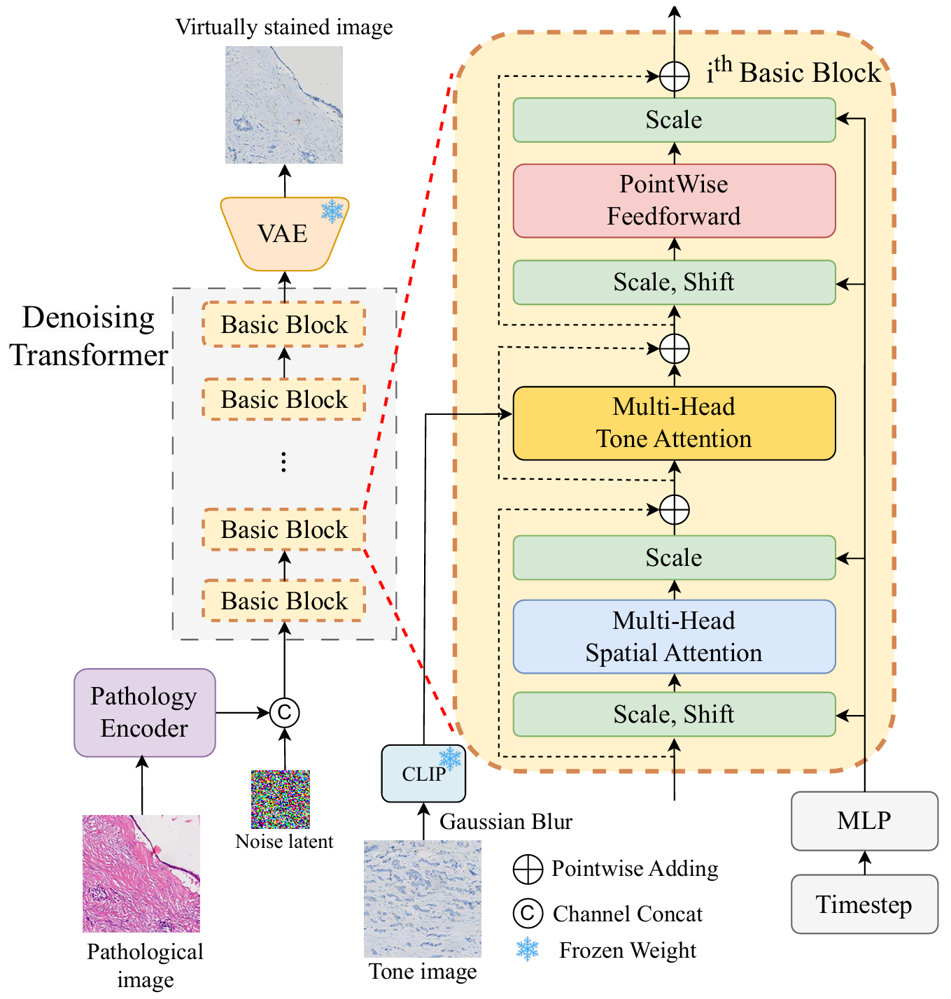
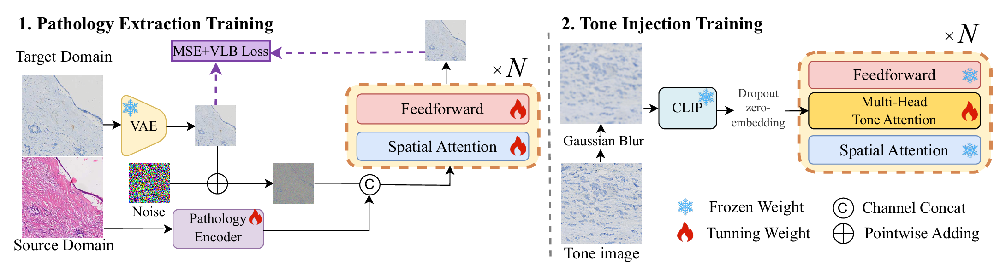
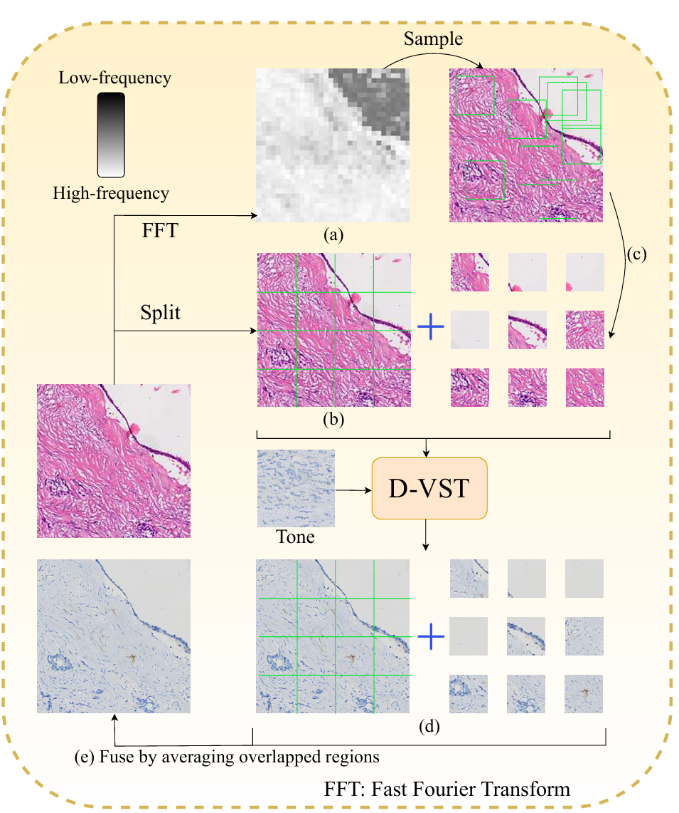

<h1 align="center"> D-VST:<br>Diffusion Transformer for Pathology-Correct Tone-Controllable Cross-Dye Virtual Staining of Whole Slide Images </h1>
<div align="center">
  <a href='https://openreview.net/pdf?id=jl0O0MYLyh'></a>  &nbsp;
  <a href='https://openreview.net/forum?id=jl0O0MYLyh'></a> &nbsp;
  <a href="https://github.com/yangshurong/D-VST"></a> &nbsp; 
  <a href='https://huggingface.co/yangshurong/D-VST'></a> &nbsp; 
</div>

## 🤗 Model
| Task    | Model |
| -------- | -------- |
| HE2IHC     | [🤗HE2IHC](https://huggingface.co/yangshurong/D-VST/blob/main) |
| FFPE2HE    | [🤗FFPE2HE](https://huggingface.co/yangshurong/D-VST/blob/main) |
| HE2mIHC    | [🤗HE2mIHC](https://huggingface.co/yangshurong/D-VST/blob/main) |

## Overview
Diffusion-based virtual staining methods of histopathology images have demon strated outstanding potential for stain normalization and cross-dye staining (e.g., hematoxylin-eosin to immunohistochemistry). 
However, achieving pathology correct cross-dye virtual staining with versatile tone controls poses significant challenges due to the difficulty of decoupling the given pathology and tone con ditions. 
This issue would cause non-pathologic regions to be mistakenly stained like pathologic ones, and vice versa, which we term “pathology leakage.” 
To address this issue, we propose diffusion virtual staining Transformer (D-VST), a new framework with versatile tone control for cross-dye virtual staining. 

<p align="center">
  
</p>

Specifically, we introduce a pathology encoder in conjunction with a tone encoder, combined with a two-stage curriculum learning scheme that decouples pathology and tone conditions, to enable tone control while eliminating pathology leakage. 



Further, to extend our method for billion-pixel whole slide image (WSI) staining, we introduce a novel frequency-aware adaptive patch sampling strategy for high-quality yet effi cient inference of ultra-high resolution images in a zero-shot manner. 

<p align="center">
  
</p>

Integrating these two innovative components facilitates a pathology-correct, tone-controllable, cross-dye WSI virtual staining process. Extensive experiments on three virtual staining tasks that involve translating between four different dyes demonstrate the superiority of our approach in generating high-quality and pathologically accurate images compared to existing methods based on generative adversarial networks and diffusion models.

## Preparation

### Environments

```bash
git clone git@github.com:yangshurong/D-VST.git
cd D-VST

conda create -n D_VST python=3.10 -y
conda activate D_VST

pip install -r requirement.txt
```

### Downloading Pretrain Weights

```bash
mkdir ./weights

HF_ENDPOINT="https://hf-mirror.com" huggingface-cli download \
  --local-dir-use-symlinks False \
  --resume-download PixArt-alpha/PixArt-XL-2-512x512 \
  --local-dir ./weights/dvst_pretrained

HF_ENDPOINT="https://hf-mirror.com" huggingface-cli download \
  --local-dir-use-symlinks False \
  --resume-download lambdalabs/sd-image-variations-diffusers \
  --include "feature_extractor/**" --include "image_encoder/**" \
  --local-dir ./weights/dvst_pretrained

HF_ENDPOINT="https://hf-mirror.com" huggingface-cli download \
  --local-dir-use-symlinks False \
  --resume-download yangshurong/D-VST \
  --local-dir ./weights/dvst_pretrained

```

## Inference

Considering the large number of patches in inference, we support multi-GPU inference for acceleration.
You can also use a single GPU for inference.

```bash
CUDA_VISIBLE_DEVICES=0,1 accelerate launch --config_file ./configs/accelerate_deepspeed.yaml \
  --main_process_port 29510 \
  --num_processes 2 \
  eval.py \
  --config configs/eval/infer2_HE2IHC.yaml
```

By modifying "checkpoint_path" in "configs/eval/infer2_HE2IHC.yaml" to other types of model weight paths, you can infer different tasks (such as FFPE2HE or HE2mIHC).

## Training

We also support multi-GPU training.

### 1. Preparing Your Data

To train the model, you need to organize paired sources (e.g. H&E) and target (e.g. IHC) image patches in a consistent directory structure. 
Each whole-slide image (WSI) should have a corresponding folder under both modalities.
The following example uses HE2IHC.

```
data/HE2IHC
├── HE
│   ├── WSI1
│   │   ├── patch1.png
│   │   ├── patch2.png
│   ├── WSI2
│   │   ├── patch1.png
│   │   ├── patch2.png
│   ├── WSI3
│       ├── patch1.png
│       ├── patch2.png
└── IHC
    ├── WSI1
    │   ├── patch1.png
    │   ├── patch2.png
    ├── WSI2
    │   ├── patch1.png
    │   ├── patch2.png
    ├── WSI3
        ├── patch1.png
        ├── patch2.png
```

Data Requirements: 

- One-to-one correspondence:
Each patch in HE/WSIx/ must have a corresponding patch with the same filename in IHC/WSIx/.

- Image resolution:
Image patches can be of any resolution, but excessively large images are not recommended due to increased memory usage and slower training.
For most use cases, patch sizes in the range of 1024×1024 to 2048×2048 pixels provide a good balance between detail and efficiency.

For virtual staining between other types of data, you can modify the training_data in the training YAML file, specifying "pose_dir" (sources) and "target_dir" (target) with the corresponding data types. 
For example, in the FFPE2HE task, "pose_dir" is FFPE and "target_dir" is HE.

### 2. Training Stage 1

```bash
CUDA_VISIBLE_DEVICES=0 accelerate launch --config_file ./configs/accelerate_deepspeed.yaml \
  --main_process_port 29510 \
  --num_processes 1 \
  train.py \
  --config configs/training/train1_HE2IHC.yaml
```

You will see a visual representation of the inference results in ./TrainResult, and the saved model weights in ./Checkpoint.

### 3. Training Stage 2

Before training begins, you need to replace "checkpoint_path" in "configs/training/train2_HE2IHC.yaml" with the model weights path obtained from stage 1 training.

```bash
CUDA_VISIBLE_DEVICES=0 accelerate launch --config_file ./configs/accelerate_deepspeed.yaml \
  --main_process_port 29510 \
  --num_processes 1 \
  train.py \
  --config configs/training/train2_HE2IHC.yaml
```

Finally, you can use the model weights obtained in stage 2 for inference. This can be done by modifying the "checkpoint_path" in "configs/eval/infer2_HE2IHC.yaml" to the model weights path obtained during stage 2 training.

### NOTE

For users with low GPU VRAM, you can use multiple GPUs and leverage Deepseed's zero2/3 capability to reduce VRAM consumption. 
We have already set the default setting to use zero2 in configs/accelerate_deepspeed.yaml.
You can also enable gradient checkpointing by setting "gradient_checkpointing" to true in the training YAML file, although this will slow down training.

## BibTeX

We would be honored if our work could be of assistance to you. 
Your citations and stars of this repository are greatly appreciated.

```
@inproceedings{D-VST,
  title={D-VST: Diffusion Transformer for Pathology-Correct Tone-Controllable Cross-Dye Virtual Staining of Whole Slide Images},
  year={2025},
  author={Shurong, Yang and Wei, Dong and Hu, Yihuang and Peng, Qiong and Liu, Hong and Huang, Yawen and Wu, Xian and Zheng, Yefeng and Wang, Liansheng},
  booktitle={The Thirty-ninth Annual Conference on Neural Information Processing Systems},
  url={https://openreview.net/pdf?id=jl0O0MYLyh}, 
}
```